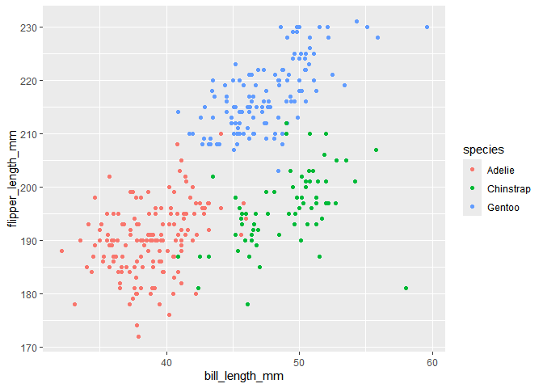

p8105_hw1_ww2745
================
2024-09-21

Here are solutions for HW1.

# Problem 1

First, we load the penguins data set and do a descriptive analysis.

``` r
data("penguins", package = "palmerpenguins")
mean_fl=mean(penguins$flipper_length_mm, na.rm = TRUE)
```

This is a dataset about penguins. It includes information for following
features: species, island, bill_length_mm, bill_depth_mm,
flipper_length_mm, body_mass_g, sex, year. For the size of the dataset,
it has 344 rows and 8 columns. The mean of the flipper length is 200.92
mm.

Then, we make a scatterplot of `flipper_length_mm`(y) vs
`bill_length_mm`(x).

``` r
ggplot(penguins, aes(x = bill_length_mm, y = flipper_length_mm, color = species)) + geom_point()
```

    ## Warning: Removed 2 rows containing missing values or values outside the scale range
    ## (`geom_point()`).

<!-- -->

``` r
ggsave(filename = "scatterplot_p1.png")
```

    ## Saving 7 x 5 in image

    ## Warning: Removed 2 rows containing missing values or values outside the scale range
    ## (`geom_point()`).

# Problem 2
